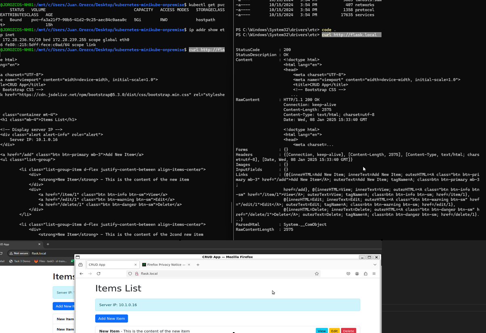

# kubernetes-minikube-onpremise

In this repo, you will create 2 pods in the `default` namespace to deploy a Flask application and a MySQL server containers. Also, we are going to use `ingress-nginx` (to handle the access to the pods) and `istio-system` (to monitor the cluster) namespaces for tooling. 

---

## Requirements 

In my case, I did it using Linux, it's not that different, but for this repo I will use Windows and WSL as a personal challenge. and that means that I am using containers for Kubernetes installation. Go grab Ubuntu with WSL and then do the magic.

* Docker Desktop running. Go to [Docker webpage](https://docs.docker.com/get-started/get-docker/). (if you are on windows) You will need to install (enable) Kubernetes in Settings>Kubernetes.
* Containerd installed. This to be able to use it as Container Runtime, you can use others but this is natively compartible with Kubernetes' Container Runtime Interface (CRI).
* Kubeadm installed. Go [here](https://kubernetes.io/docs/setup/production-environment/tools/kubeadm/install-kubeadm/) to search how to do it.
* Kubelet installed. It goes alongside Kubeadm installation, so just follow the previous one, but ensure you can access to it.
* kubectl installed. Go [here](https://kubernetes.io/docs/tasks/tools/install-kubectl-windows/) to search how to do it. Run `kubectl --version`.

## Notes

For this you will need to edit the variable for some files in order to point to your volume folder. Change them according to your needs.

Check `mysql-deployment.yml`:
* Line 12: `path: {{ vars.LOCAL_PATH }}  # Adjust for your Windows/Linux environment`
* Line 32: `value: {{ secrets.MYSQL_PASSWORD }}  # MySQL root password`
* Line 51: `value: {{ vars.MYSQL_DB }}  # Database name`

Check `flask-app-deployment.yml`:

* Line 25: `value: {{ vars.MYSQL_HOST }}  # Kubernetes internal service name for MySQL`
* Line 27: `{{ vars.MYSQL_PORT }}`
* Line 29: `{{ vars.MYSQL_USER }}`
* Line 33: `{{ vars.MYSQL_DB }}`

---

Now that you have the reqs, do this:

```
# To initialize the cluster
sudo kubeadm init --pod-network-cidr=10.24.0.0/16 # This is an example, replace it with you needs.

# Setup kubeconfig
mkdir -p ~/.kube
sudo cp -i /etc/kubernetes/admin.conf ~/.kube/config
sudo chown $(id -u):$(id -g) ~/.kube/config

# By default, the default namespace is used unless specified. To set a specific namespace:
kubectl config set-context --current --namespace=<namespace-name>

# We need a network plugin to work with Kubeadm
kubectl apply -f https://raw.githubusercontent.com/flannel-io/flannel/master/Documentation/kube-flannel.yml

# We need to install the ingress controller pods for NGINX
kubectl apply -f https://raw.githubusercontent.com/kubernetes/ingress-nginx/main/deploy/static/provider/cloud/deploy.yaml

# To create the pods
kubectl apply -f flask-app-deployment.yml 
kubectl apply -f mysql-deployment.yml

# Verify the cluster
kubectl get nodes
kubectl get deployments
kubectl get services
kubectl get pods --all-namespaces
kubectl describe ingress flask-ingress

# -----------------------------------------------------------------

# In my case I am using WSL, so I have everything working inside containers, they are a totally different host, unknown for my physical host, so we need to add twice this line in the WSL console (or file) and in system32 file.

# For WSL:
sudo nano /etc/hosts

# And then add this above/below of where you see another 127.0.0.1: 
127.0.0.1 flask.local

# And there you go, I used firefox from my WSL and it showed me the app and the values that I entered with curl 

# For Powershell

# Enter to WSL and retrieve their ip address
ip addr show eth0 | grep inet

# Now change directory to here:
Set-Location C:\Windows\System32\drivers\etc

# Do the same, in the hosts file add the ip of your WSL instance like this

<WSL_IP> flask.local

# An example:
# 198.221.30.52 flask,local
# And there you go, I used chrome from my local and it showed me the app and the values that I entered with curl from WSL

curl http://flask.local

# This is an example on how to send it new items to the app
# This is the repo that contains the logic
# https://github.com/jjorozco20/aws-flask-mysql-ansible-app/tree/main/flask-app/src
curl -X POST http://flask.local/add   -d "title=New Item"   -d "content=This is my new Item"

# -----------------------------------------------------------------

# If you want to delete the whole thing:
kubectl delete -f flask-app-deployment.yml
kubectl delete -f mysql-deployment.yml
kubectl delete -f https://raw.githubusercontent.com/flannel-io/flannel/master/Documentation/kube-flannel.yml
kubectl delete -f https://raw.githubusercontent.com/kubernetes/ingress-nginx/main/deploy/static/provider/cloud/deploy.yaml

# Follow for more! :D

# Also I did the curl test in both consoles and worked pretty well
```



And there you gooooooo!
